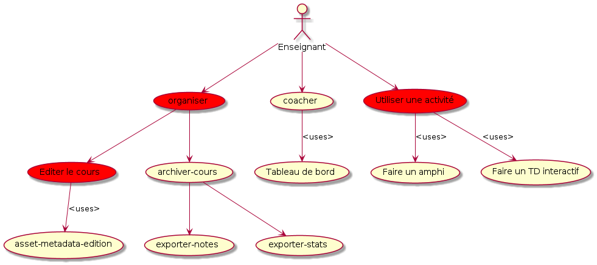

# Les cas d'utilisations pour l'enseignant

Le responsable de formation créer un cours et affecte un enseignant responsable. (par le truchement d'un LMS).

En suite l'enseignant à trois grande missions: 
* organiser et administrer le cours,
* faire cours (activités interactives) 
* suivre le groupe et les élèves réaliser la validation finale

## La mission d'organisation

1) Ecrire la fiche du cours: 
   1) le descriptif du cours.
   2) la lettre d'acceuil
   3) les objectifs de formation du cours.
   4) l'organisation du cours
   5) etc
2) Organiser le cours (contenus, ordonancement, dates, heures, groupes, rendus, livrables, etc).
   1) Structurer le cours (editer l'organisation des assets)
   2) Ajouter des assets au cours
   3) Modifier organiser  les assets
3) Faire le bilan du cours.
    1) construction et export des Notes
    2) export des statistiques
    3) remarques pour les membres
   

## La mission Faire cours

1) Faire un amphi dynamique.
2) Faire un TP dynamique

## Suivre le groupes et les élèves (coacher)

1) Visualiser le table de bord
2) Trier/Classer les élèves.
3) Affecter des activités supplémentaires a des élèves.
4) Corriger des activités  

## Les enseignants comme membre. 

Les enseignants sont membres d'au moins un cercle ce qui leur permet d'ajouter des assets dans leur cours. Voire la discription des membres. 
1) importer des ressources. Ce role est spécifique aux membres qui sont enseignants.

## Plantuml

