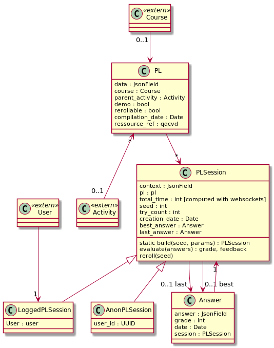

#Playexo

## Résumé

Ce module permet de jouer un exercice :
* build un exercice revient à créer une session pour un utilisateur
* grade : utilise la méthode evaluate de la session pour générer une Answer qui lui sera associée.

## Classes 

## PL

Classe contenant le json correspondant aux balises du PL.
Il connait son cours et l'activity dans lequel il est.

## Session PL

Session créée au moment de build un exercice. Elle stocke la meilleure réponse et la dernière réponse d'un utilisateur

## Session anonymes

Pour la session anonyme, un middleware vérifie si l'utilisateur est log, si ce  n'est pas le cas, on lui attribue une uuid et on créé une *AnonPLSession* s'il accède à un PL en démo

