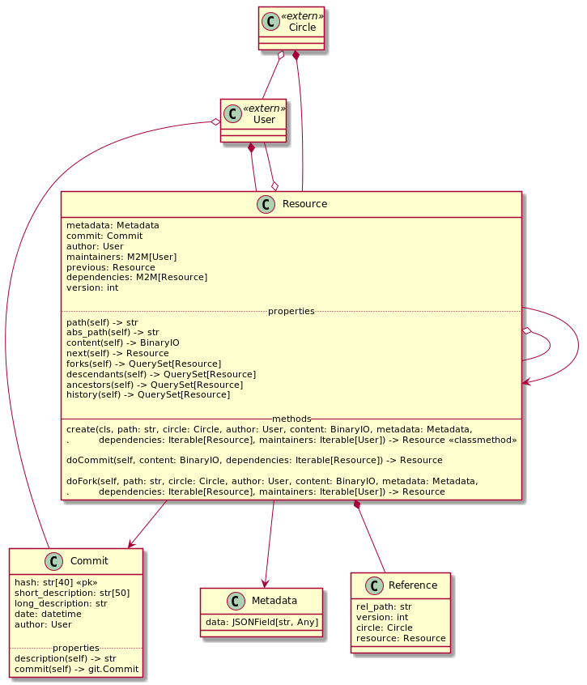

# Resource

## Résumé

Ce module s'occupe de tout ce qui est concerne les ressources : création, maj, recherche...

## Classes

### Commit

Fait le lien entre une Resource / Metadata et un commit `git`. Le hash complet correspondant au
commit sert de clé primaire.

L'auteur, la date et les description sont stockés afin d'accélérer les recherches dans la base de
données.

La propriété `description` permet d'avoir la description complète (short + long), `commit` permet
d'avoir l'instance python de [*git.Commit*](https://gitpython.readthedocs.io/en/stable/reference.html#module-git.objects.commit)
correspondant à ce Commit.

La séparation des descriptions est décrite dans
[la documentation officiel](https://git-scm.com/docs/git-commit/fr#_discussion) :

> Bien que ça ne soit pas requis, c’est une bonne pratique de commencer les messages de validation
> avec une seule ligne courte (moins de 50 caractères) pour résumer la modification, suivie d’une
> ligne blanche, suivie d’un description plus précise. Le texte jusqu’à la ligne vide du message de
> validation est traité comme le titre du commit, et ce titre est utilisé extensivement dans Git.
> Par exemple, git-format-patch[1] transforme un commit en courriel et utilise le titre comme sujet
> et le reste du texte comme corps.

### Metadata

Les champs ne pouvant être connus à l'avance, ils sont stockés dans un `JSONField`. 

### Resource

Stocke les informations relatives à une resource. Le couple `(rel_path, circle)` doit être unique.
