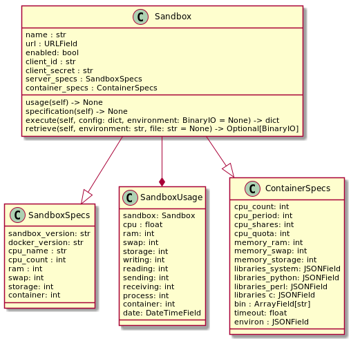

# Sandbox

## Résumé

Le module `sandbox` s'occupe de :

1. Stocker les informations relative aux sandboxes.
2. Garder un historique des statiques d'usage des sandboxes.
3. Communiquer avec les sandboxes.

## Classes

### SandboxSpecs

Stocke les informations relatives à la machine sur laquelle tourne le serveur. Ces informations
peuvent être mis à jour peu de fois (~ une fois par jour).

### ContainerSpecs

Stocke les informations relatives au container. Ces informations 
peuvent être mis à jour peu de fois (~ une fois par jour).

### SandboxUsage

Représente l'utilisation de la sandbox à une temps données. L'idée est de récupéré ces informations
à un intervalle assez cours pour permettre le création de graphe d'utilisation et pouvoir faire des
stats sur les sandboxes.

En ce qui concerne le stockage, la structure fait 456 octets. Si pour une sandbox, nous stockions
l'usage toute les 30 secondes pendant un an, nous aurions donc 479 347 200 octets (479 Mo) de pris, ce qui reste
plus qu'acceptable.

### Sandbox

L'instance de la sandbox, contient les informations permettant de se connecter au serveur,une
instance de `SandboxSpecs` et `ContainerSpecs`. Il est possible de récupéré l'ensemble des
`SandboxUsage`correspondant grâce à la relation inverse `SandboxUsage.sandbox`.

Elle contient une méthode `usage()` permettant de récupéré l'usage actuelle de la sandbox, et une
méthode `specifications()` pour les spécification. Ces méthodes modifient self et ne retourne rien.

La méthode `execute()` permet d'executer une tâche sur la sandbox.
La méthode `retrieve()` permet de récupérer un environment, ou seulement un fichier précis d'un
environment, sur la sandbox.
