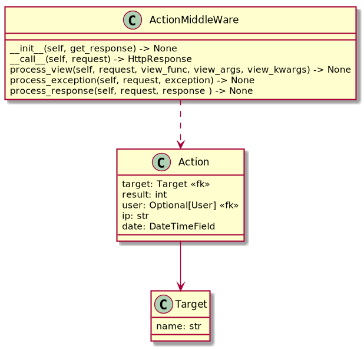

# Action

## Résumé

Le module `action` s'occupe de logger les requêtes effectué par les utilisateurs sur l'ensemble des
vues.

## Classes

### Action

Une action est représenté par une `target`, qui est la vue appelée (`[module].[view].[method]`,
par exemple `resource.Commit.post`). Le résultat corresponds au status HTTP de la réponse.

Le champ IP peut être utilisé pour potentiellement bloqué un utilisateur où mettre en place un
quota sur certaine vue.

### ActionMiddleWare

Middleware en charge d'enregistrer les actions.
