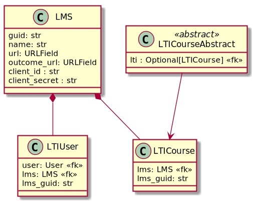

# LTI

## Résumé

Le module `lti` s'occupe de :

1. D'identifier un utilisateur venant d'un LMS.
2. De faire le lien entre les ressources d'un LMS et celle de PLaTon.
3. De remonter des notes au LMS.

## Classes

### LMS

Représente un LMS connus par PLaTon.

### LTIUser

Fait le lien entre l'utilisateur du LMS et l'utilisateur PLaTon. Un même utilisateur peut venir
de différents LMS.

### LTICourse

Fait le lien entre une classe d'un LMS et une classe PLaTon.

### LTICourseAbstract

Classe dont doit hériter le modèle représentant les classes sur PLaTon.

___

Ces deux modèles abstraits permettent de rendre le module `lti` indépendant de PLaTon.
